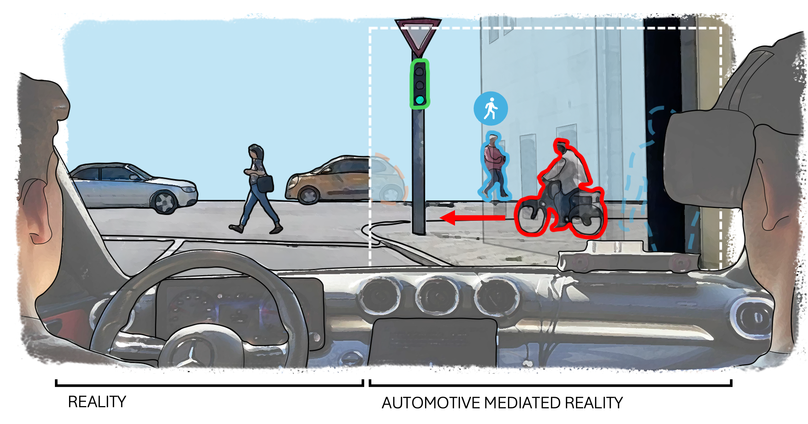

# MIRAGE: Enabling Real-Time Automotive Mediated Reality

[](https://doi.org/10.1145/3772318.3791195)
[](https://youtu.be/MMBduUx9ZG4)
[](#)



Traffic is inherently dangerous, with around 1.19 million fatalities annually. Automotive Mediated Reality (AMR) can enhance driving safety by overlaying critical information (e.g., outlines, icons, text) on key objects to improve awareness, altering objects' appearance to simplify traffic situations, and diminishing their appearance to minimize distractions. However, real-world AMR evaluation remains limited due to technical challenges. To fill this sim-to-real gap, we present `MIRAGE`, an open-source tool that enables real-time AMR in real vehicles. `MIRAGE` implements 15 effects across the AMR spectrum of augmented, diminished, and modified reality using state-of-the-art computational models for object detection and segmentation, depth estimation, and inpainting. In an on-road expert user study (N=9) of `MIRAGE`, participants enjoyed the AMR experience while pointing out technical limitations and identifying use cases for AMR. We discuss these results in relation to prior work and outline implications for AMR ethics and interaction design.


## Authors
[Pascal Jansen](https://scholar.google.de/citations?user=cR1_0-EAAAAJ&hl=en)* <sup>a b</sup>,
[Julian Britten](https://scholar.google.de/citations?user=yQ40eSIAAAAJ&hl=en&oi=ao)* <sup>a</sup>,
[Mark Colley](https://scholar.google.de/citations?user=Kt5I7wYAAAAJ&hl=en&oi=ao)* <sup>b</sup>,
Markus Sasalovici <sup>a c</sup>,
Enrico Rukzio <sup>a</sup>

**Authors contributed equally to this work*<br>
*a: Institute of Media Informatics, Ulm University*<br>
*b: UCL Interaction Centre*<br>
*c: Mercedes-Benz Tech Innovation GmbH*

## Setup
### 1. Unity 
1. Clone this repository
2. Download and install [Unity](https://unity.com/download) version `6000.2.2f1`
3. Open the `MIRAGE Unity` Project.

### 2. Preparing Computational Models
`MIRAGE` utilizes multiple computational models that need to be converted to the `ONNX` format.
After acquiring an ONNX model, add it to the Unity project.
#### Object Detection & Segmentation
We use [YOLO11-seg](https://github.com/ultralytics/ultralytics) for Object Detection and segmentation. It can be converted to `ONNX` with this Python code:

```python
from ultralytics import YOLO

model = YOLO("yolo11s-seg.pt")
model.export(format="onnx")
```
For more detailed instructions, please refer to the [Official Documentation](https://docs.ultralytics.com/tasks/segment/)

#### Depth Estimation

We use [Depth Anything V2](https://github.com/DepthAnything/Depth-Anything-V2) for metric depth estimation.
1. Download the `depth_anything_v2_vits_outdoor_dynamic` model from [this repository](https://github.com/fabio-sim/Depth-Anything-ONNX/releases/tag/v2.0.0).

#### Inpainting
We use the [MI-GAN](https://github.com/Picsart-AI-Research/MI-GAN) Inpainting Model to realize effects such as `Remove` or `Opacity`. We modified their ONNX export pipeline to improve compatibility with ours.

1. Clone the `MI-GAN` repository.
2. Replace the `/scripts/create_onnx_pipeline.py` script with our script found in the `Models/MI-GAN/create_onnx_pipeline.py` directory.
3. Follow the instructions given by the developers on how to export the model to ONNX.

### 3. Setting up Input
1. Either use a `video` or `Webcam`for input.

## Preparing a Scene
1. Open a `Pipeline` scene 
    - `Desktop UI` uses the UI from our expert evaluation. Recommend for first use
    - `Desktop` requires you to add effects by hand via the Unity Editor UI.
    - `VR` allows you to use the UI while watching the video through VR. We used this scene in our study setup. It does require additional setup.
2. Find the `CameraInput` game object. 
    - If you are using a webcam for input, hit `Refresh Camera List` and select your webcam. Untick the `Use Debug Video Input` box
    - If you are using a video, navigate to the `VideoPlayer` child object and add the video. We added additional video controls that can be used at runtime.
3. Find the `Models` Game Object. For each of the models, add the respective `ONNX` file to the `Model Asset` field.
4. Start the scene.
5. Add effects to the scene using the `UI.`
    - If you are using a scene without `UI`, refer to the `Effects` section of this README
6. Changes are saved on the UI toggle.

### Preparing the VR Scene for In-Vehicle XR Usage
1. Set up Passthrough for Unity for your XR HMD. This step depends on the XR System you're using. Please refer to the respective documentation.
    - The scene is generally empty and aside from the UI, only contains a virtual WSD (Front Glass Placeholder), through which the video projection can be seen
    - The effect is created using a stencil buffer 
2. Setting up the WSD. Select the `Front Glass Placeholder`. This is the virtual WSD, which should match your vehicle's WSD as closely as possible. 
    - Ideally, you would replace it with a 3D model of the windshield of your car using the same materials and shaders
    - Run the scene to line it up with the real world as closely as possible. If you have a full 3D model of your vehicle available, it may be better to perform this calibration step in a separate scene and then copy the transform values over afterwards.
3. Setting up the Camera: Select the `Camera Input` Object (green gizmo) and move it to match the position of the real camera mounted to the windshield as closely as possible. 
4. Adjust the `VideoProjectionSurface`: To accurately project the image back onto a surface, the FOV value needs to match your camera's FOV
    - Ideally, the FOV is high enough to cover the entire WSD.
    - A higher FOV could also cover side windows (requires additional virtual WSDs, see previous step)
    - Adjust the viewing distance if needed (changes the scale of the projection plane)
5. Testing:
    - As multiple objects that need accurate placements are involved, getting it to `look right` may require some trial and error.
    - If no changes are made to the in-vehicle setup, this only has to be done once. Make sure to document the adjustments you made 

### UI Controls
- Keyboard: Mouse or Arrow Keys, Enter/Space, ESC
- Gamepad (XBOX): Left Stick, A Button, B Button


## Available Effects  
This section lists the available visual effects and how they can be applied to detected objects. All post-processing effects are located in the `PostProcessing` directory.

When added to a scene using a `Pipeline` script, each post-processing effect is registered automatically. The `Desktop` scene already includes all available effects under the `PostProcessors` GameObject.

Each PostProcessor contains a `Class Settings` list that defines which object classes the effect applies to. `Class ID` corresponds to the class index in the COCO8 dataset (see `Resources/Models/YOLO/coco_classes.txt`).

For every effect, minimum and maximum distance ranges can be configured. Some effects expose a `Color` field. Depending on the effect, this represents either a literal color or a packed parameter vector passed to a shader.

IMPORTANT: Unity initializes colors as (0,0,0,0), which is fully transparent and may make an effect invisible. Adjust this value as needed.

If the `Class Settings` list is changed at runtime, press the `Update Classes` button to apply the changes.

Note: The effect names and parameters listed here use conceptual labels; the corresponding controls and naming in Unity’s DebugUI and Inspector may differ slightly from the paper (name in brackets).


### Augmented Reality Effects

| Effect Name        | Description                                                                 | Script(s)                                | Settings                                               | Additional Info |
|--------------------|-----------------------------------------------------------------------------|------------------------------------------|--------------------------------------------------------|------------------|
| Outline Overlay (Expand)    | Draws a colored outline around detected objects                             | PostProcessor, OutlineSegmentationShader | Class ID, Range, Color                                 | –                |
| Object Icon        | Renders a 2D icon anchored to the object’s bounding box                     | IconPostProcessor                       | Class ID, Range, Color, Location, Offset               | –                |
| Info Label (Text)        | Displays object class name and distance as a text label                     | ObjectInfoPostProcessor                 | Class ID, Range, Color, Location, Offset               | –                |
| Bounding Box       | Draws a rectangular bounding box around the object                          | BoundsPostProcessor                     | Class ID, Range, Color                                 | –                |


### Diminished Reality Effects

| Effect Name         | Description                                                                 | Script(s)                                   | Settings                                               | Additional Info |
|---------------------|-----------------------------------------------------------------------------|---------------------------------------------|--------------------------------------------------------|------------------|
| Object Removal      | Removes the object visually using inpainting                                | MIGANRunner                                | Class ID, Range                                        | Applied directly to the MI-GAN model |
| Opacity Reduction (Transparentize)   | Makes the object semi-transparent                                           | ImagePostProcessor, OpacityMaskSegmentationShader | Class ID, Range, Opacity (Color.alpha)                 | Requires Object Removal |
| Outline Only        | Removes the object interior while keeping an outline                        | –                                           | Class ID, Range, Color                                 | Combines Object Removal + Outline Overlay |
| Gaussian Blur       | Applies a blur filter over the object region                                | GaussianBlurImagePostProcessor            | Class ID, Range, Radius (Color.r), Sigma (Color.g)     | Radius (0–30)*, Sigma (0–16)* |
| Scale Down Object** | Reduces the apparent size of the object                                     | TransformPostProcessor, ImageCopyPostProcessor | Class ID, Range, Scale, Location, Offset               | Requires Object Removal |


### Modified Reality Effects

| Effect Name        | Description                                                                 | Script(s)                                   | Settings                                               | Additional Info |
|--------------------|-----------------------------------------------------------------------------|---------------------------------------------|--------------------------------------------------------|------------------|
| Color Mask         | Recolors the object using a flat color overlay                              | PostProcessor, ColoredMaskSegmentationShader | Class ID, Range, Color                                 | –                |
| Painterly Filter (Style Transfer)   | Applies a Kuwahara-style painterly filter to the object                     | ImagePostProcessor, KuwaharaSegmentationShader | Class ID, Range, Radius (Color.r), Sectors (Color.g), Strength (Color.b) | Radius (1–5)*, Sectors (4–16)*, Strength (0–255)* |
| Sprite Replace | Replaces the object with a 2D sprite prefab                                 | BoundsPostProcessor                       | Class ID, Range, Color, Location, Offset, Image Prefab | Requires Object Removal |
| Scale Up Object**  | Increases the size of the object                                             | TransformPostProcessor, ImageCopyPostProcessor | Class ID, Range, Scale                                 | Can be combined with Object Removal |
| Translate Object** | Moves the object in screen or world space                                   | TransformPostProcessor, ImageCopyPostProcessor | Class ID, Range, Location, Offset                      | Can be combined with Object Removal |
| Rotate Object**    | Rotates the object around its center                                        | TransformPostProcessor, ImageCopyPostProcessor | Class ID, Range, Rotation                              | Can be combined with Object Removal |

---

* Assumes the Unity color picker is set to RGBA (0–255)  
** Requires `TransformPostProcessor` and `ImageCopyPostProcessor` with identical class settings


## Creating new Effects
We use C# scripts and Compute Shaders to implement post-processing effects (visualizations). We provide abstract classes and documentation for various use cases:

We differentiate between CPU- and GPU-based effects.

We provide `SegmentationCommon.hlsl`, a shader file that manages the Class Settings on the shader side. It checks whether the object on which the effect could be applied is valid.

### PostProcessor (GPU)
- Script that executes a shader that adds something to the image.
- Requires the segmentation mask 
- Refer to the `ColoredMaskSegmentationShader.compute` for a simple example

### ImagePostProcessor (GPU)
- Script that executes a shader that manipulates the input image using the segmentation output
- Requires the segmentation mask and input image
- Used by the `CopySegmentationShader.cs` and `GaussianBlurImagePostProcessor.cs`
- See the `CopySegmentationShader.compute` shader for a simple example (Note: By default, the effect is applied back to the InputTexture instead of a different Output Texture)

### CPUPostProcessor (CPU)
- Abstract class that takes care of creating CPU-based effects that use Unity Prefabs to create an effect, e.g., display a bounding box
- Takes care of updating classes, initialization, and the updating loop
- Provides abstract methods that need to be implemented
- See the `IconPostProcessor.cs` script for a basic implementation


## Adding new models
We use Unity Inference Engine (formerly Unity Sentis) to execute `ONNX` models in Unity. While we provide abstract `runner` classes to simplify adding new models, we recommend reviewing the [documentation first](https://docs.unity3d.com/Packages/com.unity.ai.inference@2.2/manual/index.html).

Refer to the `ModelRunner.cs` script to get a basic understanding of how our pipeline executes models.

### Exporting to ONNX
1. Find a model you would like to use and export it to `ONNX`. 
    -   This process highly depends on the model and its implementation. 
    -   Not all `ONNX` models are [compatible](https://docs.unity3d.com/Packages/com.unity.ai.inference@2.2/manual/supported-operators.html)
    - Note: We can't assist in exporting models to ONNX. Please refer to the developers of the models.
2. Add the model to Unity. If no errors are thrown, the model is most likely compatible.
3. Write down the input and output tensors

### Creating a ModelRunner script
1. Inherit from `ModelRunner.cs` (or `InpaintingRunner`, `DepthEstimationRunner`, or `SegmentationRunner` if your model fulfills one of these tasks)
2. Implement the abstract methods. 
    - Use `YOLORunner`, `MIGANRunner`, or `DepthAnythingRunner` for inspiration
3. Create a new scene, add the model and a `ModelExecutor` to it
    - Alternatively, duplicate a scene in `Scenes/Models/` and replace the model
    - Take a look at these scenes for inspiration
4. Set the parameters for your model
5. Run the model
6. As models heavily rely on each other as part of the pipeline, the `Pipeline.cs` script has to be modified to incorporate another model.


## Benchmarks
This section covers benchmark results and instructions for conducting benchmark tests. The data is located in the 'Benchmarks' folder.

### Results
| Hardware                                                                       | Segmentation ms                     | Inpainting ms                       | Depth Estimation ms                 | Post Processing ms               | Unity FPS                          |
|--------------------------------------------------------------------------------|-------------------------------------|-------------------------------------|-------------------------------------|----------------------------------|------------------------------------|
| 11th Gen Intel(R) Core(TM) i7-11700K @ 3.60GHz : NVIDIA GeForce RTX 3080         | 133.66 ± 33.45 | 146.78 ± 35.07 | 148.48 ± 30.99 | 0.11 ± 0.12 | 20.77 ± 10.95 |
| AMD Ryzen 5 9600X 6-Core Processor : NVIDIA GeForce RTX 4070 Ti SUPER           | 75.52 ± 20.19                       | 85.18 ± 19.78                       | 85.30 ± 19.64                       | 0.05 ± 0.12                      | 28.48 ± 9.59                       |
| Intel(R) Core(TM) i7-14700F : NVIDIA GeForce RTX 4080 SUPER | 88.53 ± 25.38  | 105.43 ± 28.35 | 106.90 ± 25.37 | 0.07 ± 0.10 | 28.92 ± 14.28 |
| Intel(R) Core(TM) i7-14700KF : NVIDIA GeForce RTX 4090                           | 72.39 ± 15.41                       | 86.41 ± 20.33                       | 87.37 ± 17.93                       | 0.04 ± 0.09                      | 28.43 ± 12.16                      |
| Intel(R) Core(TM) i7-14700K : NVIDIA GeForce RTX 5080       | 57.50 ± 15.84  | 71.87 ± 23.75  | 72.23 ± 23.20  | 0.04 ± 0.09 | 38.89 ± 17.32 |


Note that since the models run independently in the `parallel` pipeline mode, there is no shared total iteration time.
Further, the Unity FPS solely refers to the updated content; passthrough capabilities run without interference at the headset's set frequency (90 Hz for the Varjo 3).


### How to Benchmark
1. Open one of the existing Benchmark scenes.
2. These scenes are pre-configured with postprocessing effects that ensure all components of the pipeline are used (models, shaders, CPU effects)
3. Assign the models as described in the [Preparing a Scene](#preparing-a-scene) section. 
4. Adjust the BenchmarkManager Script in the Inspector accordingly. By default, a 60-second benchmark will begin on launch.
5. Use the `Benchmark Controller` window via the `MIRAGE` menu item to control the benchmark manually.
6. The results of the benchmark will be reported in the console.
7. If enabled, the logging data will also be exported as `.csv` files. They can be found in the `MIRAGE Unity/BenchmarkExports/` directory.
8. The `BenchmarkAutomation` can be used to automate the Benchmark process.


## Expert User Study
The data from the expert user study and the evaluation script are located in the 'ExpertSurvey' folder.

Participants' verbal feedback was automatically transcribed using [OpenAI Whisper](https://github.com/openai/whisper).

## Statistical Analysis
The statistical analyses (benchmark and expert user study) were tested with the following setup:

1. RStudio 2026.01.0
2. R version 4.5.2
3. Rtools45

## Citation

If you use this work, please cite it as:

Pascal Jansen, Julian Britten, Mark Colley, Markus Sasalovici, and Enrico Rukzio. 2026. **MIRAGE: Enabling Real-Time Automotive Mediated Reality.** In *Proceedings of the 2026 CHI Conference on Human Factors in Computing Systems (CHI ’26)*, April 13–17, 2026, Barcelona, Spain. ACM. DOI: 10.1145/3772318.3791195

```
@inproceedings{jansen2026mirage,
  author    = {Jansen, Pascal and Britten, Julian and Colley, Mark and Sasalovici, Markus and Rukzio, Enrico},
  title     = {MIRAGE: Enabling Real-Time Automotive Mediated Reality},
  booktitle = {Proceedings of the 2026 CHI Conference on Human Factors in Computing Systems (CHI '26)},
  year      = {2026},
  month     = apr,
  location  = {Barcelona, Spain},
  publisher = {ACM},
  doi       = {10.1145/3772318.3791195},
  isbn      = {979-8-4007-2278-3/2026/04}
}
```

## References

- [Unity Inference Engine](https://docs.unity3d.com/Packages/com.unity.ai.inference@2.2/)

The UI was built using
- [Unity UI Extensions](https://github.com/Unity-UI-Extensions/com.unity.uiextensions) 
- [HSV Color Picker](https://github.com/judah4/HSV-Color-Picker-Unity)

Graphics for (Replace Effect)
- https://de.m.wikipedia.org/wiki/Datei:Person_icon_BLACK-01.svg
- https://de.wikipedia.org/wiki/Datei:Car_pictogram.svg
